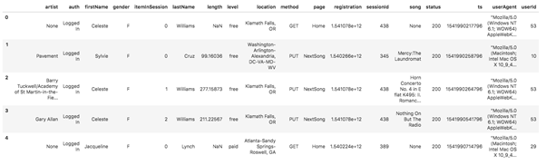

# Data Lake with Spark in AWS

## Project Objective

Implementing a data lake in AWS cloud with AWS S3, EMR and Spark

## Overview

A music streaming startup, Sparkify, has grown their user base and song database even more and want to move their data warehouse to a data lake. Their data resides in S3, in a directory of JSON logs on user activity on the app, as well as a directory with JSON metadata on the songs in their app.

As their data engineer, you are tasked with building an ETL pipeline that extracts their data from S3, processes them using Spark, and loads the data back into S3 as a set of dimensional tables. This will allow their analytics team to continue finding insights in what songs their users are listening to.

## Project Datasets

You'll be working with two datasets that reside in S3. Here are the S3 links for each:

> • Song data: s3://udacity-dend/song_data  
> • Log data: s3://udacity-dend/log_data 

### Song Dataset

The first dataset is a subset of real data from the Million Song Dataset. Each file is in JSON format and contains metadata about a song and the artist of that song.
These files are partitioned by the first three letters of each song's track ID. For example, here are filepaths to two files in this dataset.

> song_data/A/B/C/TRABCEI128F424C983.json
>
> song_data/A/A/B/TRAABJL12903CDCF1A.json

And below is an example of what a single song file, TRAABJL12903CDCF1A.json, looks like.

`{"num_songs": 1, "artist_id": "ARJIE2Y1187B994AB7", "artist_latitude": null, "artist_longitude": null, "artist_location": "", "artist_name": "Line Renaud", "song_id": "SOUPIRU12A6D4FA1E1", "title": "Der Kleine Dompfaff", "duration": 152.92036, "year": 0}`

## Log Dataset

The second dataset consists of log files in JSON format generated by this [**event simulator**](https://github.com/Interana/eventsim) based on the songs in the dataset above. These simulate app activity logs from an imaginary music streaming app based on configuration settings.

The log files in the dataset you'll be working with are partitioned by year and month. For example, here are filepaths to two files in this dataset.

> log_data/2018/11/2018-11-12-events.json
>
> log_data/2018/11/2018-11-13-events.json

And below is an example of what the data in a log file, 2018-11-12-events.json, looks like.

## Data Lake Schema
This project implements a star schema. songplays is the fact table in the data model, while users, songs, artists, and time are all dimensional tables.

### Fact Table
* songplays - records in event data associated with song plays (records with page = NextSong)
    * start_time, userId, level, sessionId, location, userAgent, song_id, artist_id, songplay_id
* Dimensional Tables
    * users - users of the Sparkify app.
        * firstName, lastName, gender, level, userId
    * songs - collection of songs.
        * song_id, title, artist_id, year, duration
    * artists - information about artists.
        * artist_id, artist_name, artist_location, artist_lattitude, artist_longitude
    * time - timestamps of records in songplays, deconstructed into various date-time parts.
        * start_time, hour, day, week, month, year, weekday

## Project Structure

├── dl.cfg       # Configuration file containing AWS IAM credentials  
├── etl.py       # ETL processes using Spark  
├── etl-test.py   # Test codes in local environment  
├── data folder  # Contain song data and log data files for testing in local environment  
└── README.md  

## Project Steps
1. Create an IAM User for EMR with access to S3 bucket
The first step is to create a new IAM user with programmatic access. Once created, note down the access key ID and secret access key and update `dl.cfg` accordingly.
> [AWS]  
> AWS_ACCESS_KEY_ID=XXXXXXXXXXXXXXXXXXX  
> AWS_SECRET_ACCESS_KEY=XXXXXXXXXXXXXXXXXXXX

2. Create an AWS S3 bucket for output data
Specify an AWS S3 bucket and folder to store the data with an ETL process. Once created, updated in etl.py  
`output_data = "s3a://XXXXX-output/"` 

3. Create an EC2 Key Pair
To connect to EMR from your local computer, you will need to have an EC2 key pair. Once ctreated, download the pem file for later use.

4. Create an EMR cluster
EMR CLI is as follows: 
`aws emr create-cluster --auto-scaling-role EMR_AutoScaling_DefaultRole --applications Name=Hadoop Name=Hive Name=Spark --ebs-root-volume-size 10 --ec2-attributes '{"KeyName":"spark-cluster-ssh","InstanceProfile":"EMR_EC2_DefaultRole","SubnetId":"subnet-db68ca91","EmrManagedSlaveSecurityGroup":"sg-0c0c97745940a0xxx","EmrManagedMasterSecurityGroup":"sg-0c66b3a2afb2xxx"}' --service-role EMR_DefaultRole --enable-debugging --release-label emr-5.33.0 --log-uri 's3n://aws-logs-xxxx9-us-west-2/elasticmapreduce/' --name 'My-spark-cluster' --instance-groups '[{"InstanceCount":1,"EbsConfiguration":{"EbsBlockDeviceConfigs":[{"VolumeSpecification":{"SizeInGB":32,"VolumeType":"gp2"},"VolumesPerInstance":2}]},"InstanceGroupType":"MASTER","InstanceType":"m5.xlarge","Name":"Master - 1"},{"InstanceCount":2,"EbsConfiguration":{"EbsBlockDeviceConfigs":[{"VolumeSpecification":{"SizeInGB":32,"VolumeType":"gp2"},"VolumesPerInstance":2}]},"InstanceGroupType":"CORE","InstanceType":"m5.xlarge","Name":"Core - 2"}]' --configurations '[{"Classification":"spark","Properties":{"maximizeResourceAllocation":"true"}}]' --scale-down-behavior TERMINATE_AT_TASK_COMPLETION --region us-west-2` 
Once created, under Security groups for Master, add Inbound rules:  
> Type: SSH, Protocol: TCP, Port range: 22
 
* This step is important, becuase without this step you can't SSH to EMR.

5. Load etl.py and dl.cfg to a S3 bucket 
This step is for loading the scripts to EMR cluster in the later step.

6. Connect to EMR cluster and run the program. 
Open an terminal/ ubunto instance, run the following CLI: 
    a. aws configure to setting up aws authentication  
        CLI: `aws configure` 
        In the following input spaces, enter your Access key ID, Secret access key, region, and output format 
    b. Run this cli to check the available EMR instances 
        `aws emr list-instances` 
    c. If the created EMR instance is in waiting mode, you can run the following to establish a ssh connection 
        `ssh hadoop@ec2-54-71-73-xxx.us-west-2.compute.amazonaws.com -i spark-cluster-ssh.pem` 
    d. Copy the two files from s3 bucket to the EMR cluster, under the hadoop folder: 
        `aws s3 cp s3://mydatalake-bucketname/dl.cfg /home/hadoop/dl.cfg` 
        `aws s3 cp s3://mydatalake-bucketname/etl.py /home/hadoop/etl.py` 
    e. list the item to make sure the copy command was successful. 
    d. In the home directory on the EMR master node (/home/hadoop), run the following command to execute the etl.py: 
        `spark-submit etl.py`
    
